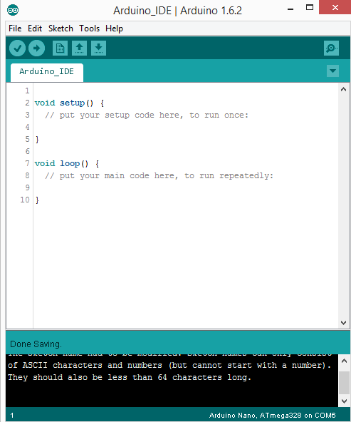
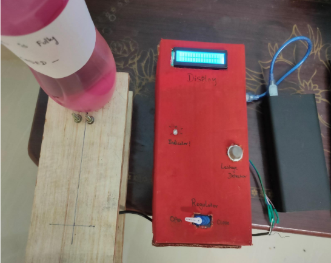
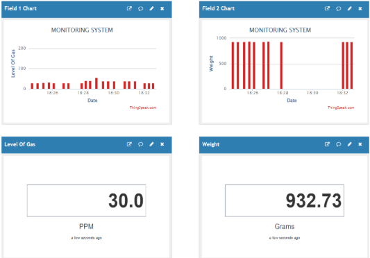

# LPG-CYLINDER-WEIGHT-AND-GAS-LEAKAGE-MONITORING-SYSTEM-BASED-on-IoT
## Abstract
This system aims to raise awareness about gas leakage, particularly in regions like India where approximately 33 crore people rely on LPG. The potential dangers associated with even a small gas leakage prompted the development of this IoT-based solution. The system utilizes MQ6 sensors, load cells, servo motors, buzzers, LEDs, and LCD displays to detect gas leaks, monitor cylinder weight, and provide timely alerts to users. With the integration of a Wi-Fi module, the system enables data storage in the cloud, facilitating remote access and efficient cylinder management.
## Problem Statement
In India, LPG is widely used for household and industrial purposes, but the increasing demand for LPG has led to a rise in accidents, particularly due to cylinder explosions. Small, unnoticed gas leakages contribute to major accidents, necessitating a reliable detection and control system. This project addresses these challenges by implementing MQ-6 sensors for precise gas detection, load cells for weight measurement, and IoT for cloud-based data storage and timely alerts. The system aims to enhance safety and prevent accidents associated with LPG usage.
## Introduction
In India, approximately 33 crore people use LPG, making it an essential fuel source for households and industries. However, the inherent risks associated with LPG, especially gas leakages, pose serious threats to lives and property. Instances like the Bhopal gas tragedy underscore the need for effective gas leakage detection and control systems. In Nigeria, where LPG is a primary fuel in homes and industries, strategic measures are required to protect against incidents such as suffocation and explosions.
### Aim of the Project
The proposed project aims to detect and control LPG leakage at home using an MQ-6 sensor. The system triggers a buzzer when it detects LPG content in the air, alarming the user until the knob is locked. Additionally, the system continuously measures the weight of the gas cylinder using a load cell. When the weight of the cylinder reaches a minimum threshold, the user is alerted through an LED light. The integration of a Wi-Fi module enables data storage in the cloud, accessible from anywhere, facilitating timely cylinder booking. The use of an Arduino Uno microcontroller ensures ease of programming and rapid prototyping.

## Literature Review
The system is highly reliable, tamper-proof, and secure. In the long run, the maintenance cost is efficient. It is highly accurate (A. Sood, B. Sonkar, A. Ranjan, Mr. A. Faisal, June 2015). Liquefied Petroleum Gas (LPG) consists of a mixture of Commercial Propane and Commercial Butane, with added odorant Ethyl Herceptin for easy leak detection. LPG, a common fuel for heating and cooking, is highly flammable. Before electronic gas detectors, chemically infused paper was used to detect gas presence. The proposed project focuses on detecting economic fuels like petroleum and LPG using gas sensors.

## Project Methodology
The gas leakage detection system consists of an ESP8266 module, MQ-6 gas sensor, LED, and buzzer. The cloud service used is Thingspeak.com. The system is strategically placed near the cylinder knob for efficient gas leakage detection. The load cell, Arduino module, and LCD screen form the weight monitoring system, placed at the base of the cylinder. Calibration is necessary for weight measurement, and the system displays real-time readings on the LCD screen. Alerts are triggered for low weight or an empty cylinder. The block diagram illustrates the components and their connections.

### Proposed Block Diagram

## Components
### Microcontroller Module (Arduino Uno)
The Arduino Uno is a compact microcontroller used to control embedded electronic systems. It reads the environment temperature from the sensor module, displays characters on the LCD, and controls pins as per the program.

### MQ6 Gas Sensor
The MQ6 Gas Sensor detects various gases, with specifications including power requirements, detecting concentration, and sensitivity. It has a rapid response time and high sensitivity.

### Load Cell
The load cell, calibrated with an HX711 amplifier, measures the weight of the gas cylinder. It provides measurable data with an accuracy of +/-5%.

### Sound Module (Buzzer)
The buzzer alarms when the microcontroller detects a gas leakage, providing an audible alert to users.

### Display Module (LCD)
The LCD screen displays real-time weight readings from the load cell. It is a 16x2 LCD with two registers for commands and data.

### LED Bulb
A light-emitting diode (LED) serves as an indicator, glowing for specific weight conditions or for demo purposes.

### Servo Motor
The servo motor controls the automatic closure of the gas knob when a gas leak is detected, enhancing safety.

### Wi-Fi Module (ESP8266)
The Wi-Fi module facilitates communication between devices and enables data storage in the cloud, accessible remotely.

### Power Supply
The power supply is provided by a USB cable connecting the Arduino Uno to a power bank, eliminating the need for a separate power source.

### Arduino Software (IDE)
The Arduino Integrated Development Environment (IDE) is used to write sketches, programs written for Arduino boards. It provides a text editor, message area, console, toolbar, and menus for coding and uploading.

### Writing Sketches
Programs, known as sketches, are written using the Arduino IDE. These sketches are saved with the file extension .ino and are written in the text editor. The console displays feedback, including errors.
## Working Method

The primary objective of the LPG Leakage and Weight Monitoring System is to ensure the safety of the consumer through continuous gas sensing and level monitoring. The efficient and fast-working controller is crucial for prompt responses to gas leakage detection and weight measurement. Additionally, the system must have the capacity to store relevant information for further analysis.
### Working Model:

The gas sensor (MQ6) continuously monitors the environment for LPG gas. Simultaneously, the weight sensor (Load Cell) measures the weight of the gas cylinder. These sensors are connected to the analog and digital pins of the Arduino UNO, serving as input devices.

The collected data from the sensors is processed by the microcontroller, which takes corrective actions based on the sensor outputs. The information is then displayed on the LCD module (16x2), providing real-time updates on gas leakage and cylinder weight.

In the event of a gas leak exceeding a hazardous level, the buzzer is triggered to raise an alarm, and the system automatically closes the gas knob using a servo motor. Similarly, the continuous measurement of the cylinder's weight allows the LED to indicate when the cylinder is nearing empty.

All the collected data can be conveniently viewed on the cloud using the Wi-Fi module, enabling remote monitoring and data access.
## Prototype

## Results and Discussion

The purpose of the system is to provide safe, reliable, simple, and cost-effective LPG leakage detection and control. The aim is to modify existing safety models in the house, offering a quick response and precise detection and control in critical situations.

## Conclusion

The scope of this project was to increase the safety of people while cooking. The system employs two analog sensors working in a closed environment, measuring values and providing safety measures. The indication system alerts via buzzer and LED, and the measures can be viewed on the display module. Using the Wi-Fi module, information can be accessed from anywhere through THINK SPEAK.COM.

